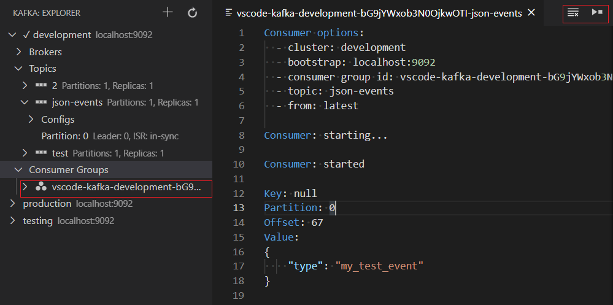
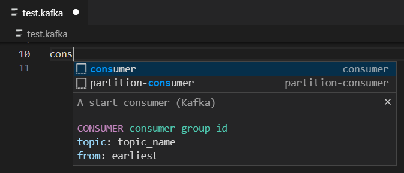
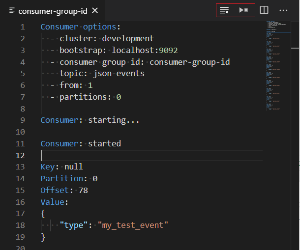

# Consuming messages

Consuming topics can be done:

* from the [Kafka Explorer](#kafka-explorer), by right-clicking on a topic and selecting "Start Consumer".
* from [Kafka file](#kafka-file) by clicking on `Start consumer` / `Stop consumer` codelens available from `CONSUMER` block.
* from the [Start Consumer](#start-consumer-command), from the command palette.

## Consume with ...

### Kafka explorer

You can start consuming messages from the [Kafka Explorer](Explorer.md#explorer), by right-clicking on a topic:


Once this command is launched, it creates a consumer group (with an auto-generated id), and opens the [Consumer View](#consumer-view) where you can see the messages being consumed:



In this case, the starting offset can be only be configured via the [kafka.consumers.offset](#kafkaconsumersoffset) preference.

Known limitations:

* UTF-8 encoded keys and values only. If data is encoded differently, it will not be pretty.
* One consumer group is created per topic (may change in the future to just have one for the extension).

### Kafka file

Consumming can be done by creating a [.kafka](KafkaFile.md#kafkafile) file. Write simple consumer using the following format:

```
CONSUMER consumer-group-id
topic: json-events
partitions: 0
from: 1
```

For actually consuming the topic, click on the `Start consumer` link above the `CONSUMER` line:


The CONSUMER block specifies : 

 * the `consumer group id` which is declared after CONSUMER (optional).
 * the `topic` id (required).
 * the `from` offset which can takes `earliest`, `latest` or a `number` as value (optional).
 * the `partitions` which is a number or a range, or a combinaison of ranges (optional). Example: 
    * 0
    * 0,1,2
    * 0-2
    * 0,2-3

A codelens is displayed above each `CONSUMER` line to show the `status` of the consumer (started / stopped).and provides `Start consumer` / `Stop consumer` commands according to the status

To write quickly a CONSUMER, completion snippets for consumer will help you:



### Start Consumer command


## Consumer View

The `Consumer View` is a read-only editor which shows consumed messages for a given topic:



This editor provides 2 commands on the top right of the editor:

 * `Clear Consumer View`: clears the view.
 * `Start/Stop`: to stop or (re)start the consumer.

Consumers are based on virtual documents, available in the VS Code extension API. A consumer will keep running even if you close the document in the editor. You should make sure to close the consumer explicitly, either via the command palette, the status bar element or the start/stop action button as well. The VS Code API does not support detecting if a virtual document is closed immediately. Instead, the underlying virtual document is automatically closed after two minutes if the document is closed in the editor.

## Preferences

### `kafka.consumers.offset`

You can configure start offset for new consumers in settings (earliest, latest).
