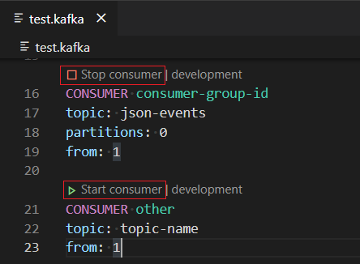

# Consuming messages

Consuming topics can be done:

* from the [Kafka Explorer](#kafka-explorer), by right-clicking on a topic and selecting "Start Consumer".
* from a [.kafka](KafkaFile.md#kafkafile) file by clicking on the `Start consumer` codelens displayed above a `CONSUMER` block.
* from the [Start Consumer](#start-consumer-command), from the command palette.

## Consume with ...

### Kafka explorer

You can start consuming messages from the [Kafka Explorer](Explorer.md#explorer), by right-clicking on a topic:


Once this command is launched, it creates a consumer group (with an auto-generated id), and opens the [Consumer View](#consumer-view) where you can see the messages being consumed:


In this case, the starting offset can be only be configured via the [kafka.consumers.offset](#kafkaconsumersoffset) preference.

Known limitations:

* UTF-8 encoded keys and values only. If data is encoded differently, it will not be pretty.
* One consumer group is created per topic (may change in the future to just have one for the extension).

### Kafka file

Define simple consumers in a `.kafka` file, using the following format:

```
CONSUMER consumer-group-id
topic: json-events
partitions: 0
from: 1
```

Click on the `Start consumer` link above the `CONSUMER` line to start the consumer group:



The `CONSUMER` block defines:

 * `consumer group id` which is declared after CONSUMER *[required]*.
 * `topic`: the topic id *[required]*.
 * `from`: the offset from which the consumer group will start consuming messages from. Possible values are: `earliest`, `latest`, or an integer value. *[optional]*.
 * `partitions` [**EXPERIMENTAL option**] : the partition number(s), or a partitions range, or a combinaison of partitions ranges *[optional]*. eg:
    * 0
    * 0,1,2
    * 0-2
    * 0,2-3
 * `key-format` : [deserializer](#Deserializer) to use for the key *[optional]*.
 * `value-format` : [deserializer](#Deserializer) to use for the value *[optional]*.

#### Deserializer

The deserializers can have the following value:

   * `none`: no deserializer (ignores content).
   * `string`: similar deserializer to the Kafka Java client [org.apache.kafka.common.serialization.StringDeserializer](https://github.com/apache/kafka/blob/master/clients/src/main/java/org/apache/kafka/common/serialization/StringDeserializer.java) which currently only supports `UTF-8` encoding.
   * `double`: similar deserializer to the Kafka Java client [org.apache.kafka.common.serialization.DoubleDeserializer](https://github.com/apache/kafka/blob/master/clients/src/main/java/org/apache/kafka/common/serialization/DoubleDeserializer.java).
   * `float`: similar deserializer to the Kafka Java client [org.apache.kafka.common.serialization.FloatDeserializer](https://github.com/apache/kafka/blob/master/clients/src/main/java/org/apache/kafka/common/serialization/FloatDeserializer.java).
   * `integer`: similar deserializer to the Kafka Java client [org.apache.kafka.common.serialization.IntegerDeserializer](https://github.com/apache/kafka/blob/master/clients/src/main/java/org/apache/kafka/common/serialization/IntegerDeserializer.java).
   * `long`: similar deserializer to the Kafka Java client [org.apache.kafka.common.serialization.LongDeserializer](https://github.com/apache/kafka/blob/master/clients/src/main/java/org/apache/kafka/common/serialization/LongDeserializer.java).
   * `short`: similar deserializer to the Kafka Java client [org.apache.kafka.common.serialization.ShortDeserializer](https://github.com/apache/kafka/blob/master/clients/src/main/java/org/apache/kafka/common/serialization/ShortDeserializer.java). 

#### Code Lens

A codelens is displayed above each `CONSUMER` line, and provides `Start consumer` / `Stop consumer` commands depending on the consumer group status.

#### Completion

Completion snippets can help you quickly bootstrap new `CONSUMER` blocks:


### Start Consumer command


## Consumer View

The `Consumer View` is a read-only editor which shows consumed messages for a given topic:


This editor provides 2 commands on the top right of the editor:

 * `Clear Consumer View`: clears the view.
 * `Start/Stop`: to stop or (re)start the consumer.

Consumers are based on virtual documents, available in the VS Code extension API. A consumer will keep running even if you close the document in the editor. You should make sure to close the consumer explicitly, either via the command palette, the status bar element or the start/stop action button as well. The VS Code API does not support detecting if a virtual document is closed immediately. Instead, the underlying virtual document is automatically closed after two minutes if the document is closed in the editor.

## Preferences

### `kafka.consumers.offset`

You can configure start offset for new consumers in settings (earliest, latest).
