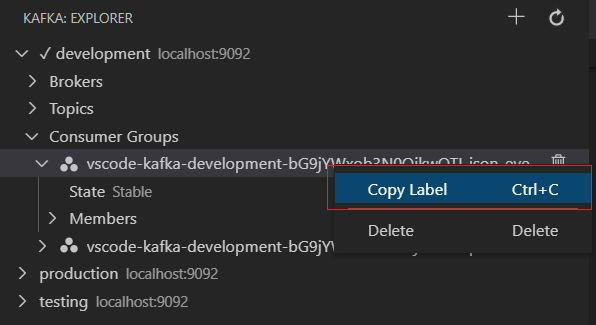
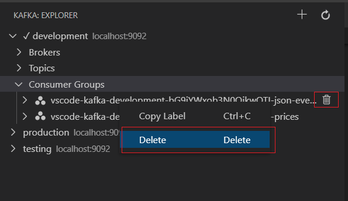

# Explorer

The Kafka explorer shows configured clusters with their topics, brokers, consumers and configurations.

## Cluster Item

The explorer shows clusters, click on right button on cluster provides several menu items.

### Select Cluster

Before using a [.kafka file](KafkaFile.md#kafkafile) you must select the cluster. You can do that with the `Select cluster` menu item:

## Actions

### Copy Label

You can copy the label of any tree node in the clipboard with `Ctrl+C` (`Cmd+C` on Mac) or  via the `Copy Label` contextual menu:

### Delete

You can delete clusters, topics and consumer groups with the `Delete` (`Cmd+Delete` on Mac) key, the `Trashcan` icon or `Delete` contextual menu:

Multiple delete is not supported for the moment. See [issue 107](https://github.com/jlandersen/vscode-kafka/issues/107).

To delete a consumer group, it first must be stopped, else the `Delete` action will report an error.

## Preferences

### `kafka.explorer.topics.sort`

Choose sorting for topics in explorer.

### `kafka.explorer.topics.filter`

Glob patterns filtering topics out of the Kafka explorer. `*` matches any string, `?` matches a single character.

### `kafka.explorer.consumers.filter`

Glob patterns filtering consumer groups out of the Kafka explorer. `*` matches any string, `?` matches a single character.