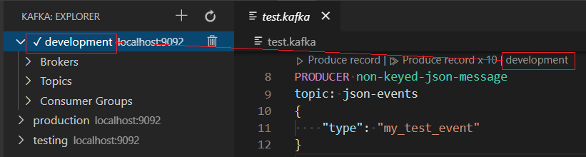
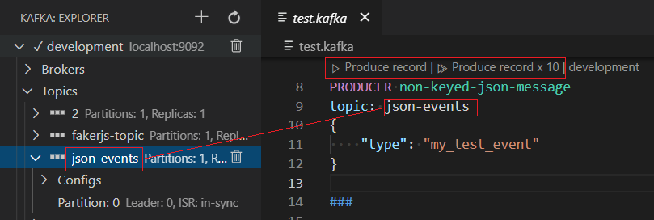
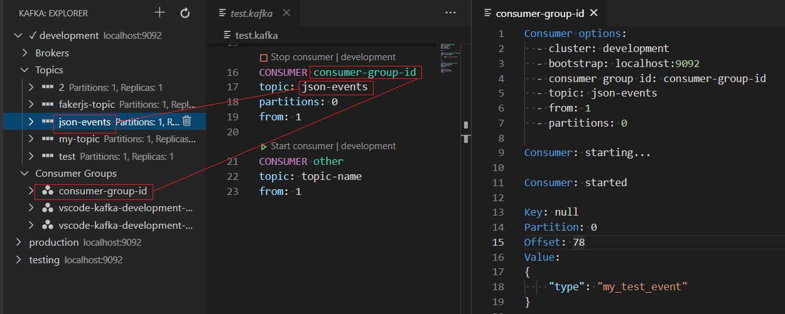

# Kafka file

A Kafka file is a file with `.kafka` file extension which provides the capability to declare:

 * [PRODUCER](#PRODUCER) to produce records.
 * [CONSUMER](#CONSUMER) to start /stop consumer. 
 
for a given cluster. 

## Select cluster

Before using a `.kafka` file you must select the cluster:

Once the cluster is selected, you should see it in the `.kafka` file with the following codelens:

## PRODUCER

You can declare `PRODUCER` block to produce records:
 
 
 
See [Producing messages](Producing.md#producing) for more informations.

## CONSUMER

You can declare `CONSUMER` block  to start/stop consumer with a given group id, offset, partitions:
 

See [Consuming messages](Consuming.md#kafka-file) for more informations.