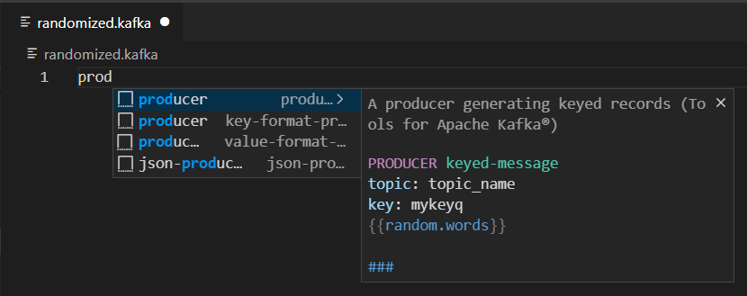
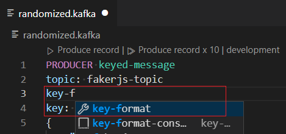
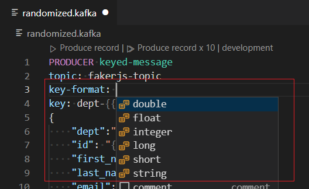
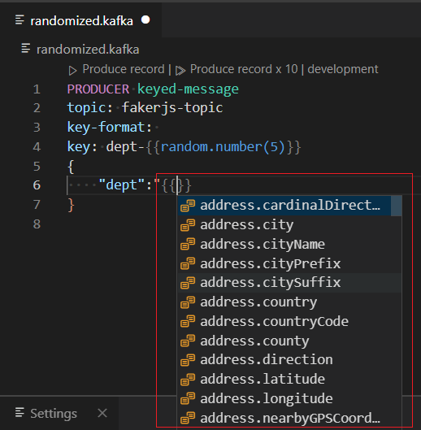
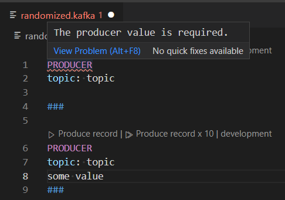
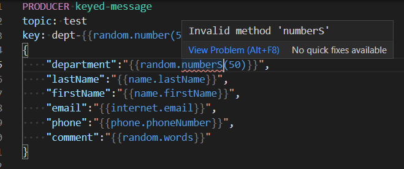
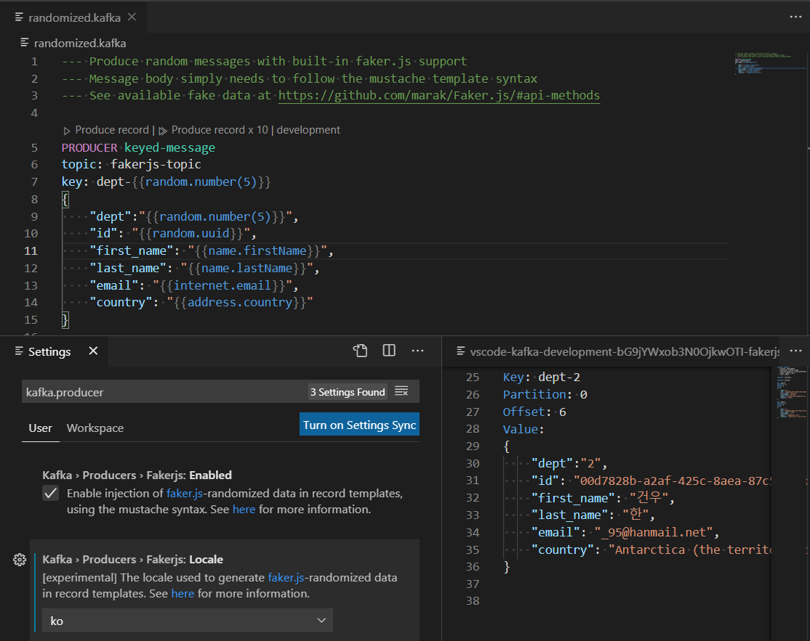

# Producing messages

Define simple producers in a [.kafka](KafkaFile.md#kafkafile) file, using the following format:

```
PRODUCER keyed-message
topic: my-topic
key: mykeyq
record content

###

PRODUCER non-keyed-json-message
topic: json-events
{
    "type": "my_test_event"
}
```

To produce a single record, click on the `Produce record` link above the `PRODUCER` line; to produce 10 records, click on `Produce record x 10`.


The log about produced messages is printed in the `Kafka Producer Log` Output view.

The `PRODUCER` block defines:

 * `keyed message` which is declared after PRODUCER *[optional]*.
 * `key`: the key *[optional]*.
 * `key-format` : [serializer](#Serializer) to use for the key *[optional]*.
 * `value-format` : [serializer](#Serializer) to use for the value *[optional]*.
 
 * the rest of the content is the value until `###`.

### Serializer

The serializers can have the following value:

   * `string`: similar serializer to the Kafka Java client [org.apache.kafka.common.serialization.StringSerializer](https://github.com/apache/kafka/blob/master/clients/src/main/java/org/apache/kafka/common/serialization/StringSerializer.java) which currently only supports `UTF-8` encoding.
   * `double`: similar serializer to the Kafka Java client [org.apache.kafka.common.serialization.DoubleSerializer](https://github.com/apache/kafka/blob/master/clients/src/main/java/org/apache/kafka/common/serialization/DoubleSerializer.java).
   * `float`: similar serializer to the Kafka Java client [org.apache.kafka.common.serialization.FloatSerializer](https://github.com/apache/kafka/blob/master/clients/src/main/java/org/apache/kafka/common/serialization/FloatSerializer.java).
   * `integer`: similar serializer to the Kafka Java client [org.apache.kafka.common.serialization.IntegerSerializer](https://github.com/apache/kafka/blob/master/clients/src/main/java/org/apache/kafka/common/serialization/IntegerSerializer.java).
   * `long`: similar serializer to the Kafka Java client [org.apache.kafka.common.serialization.LongSerializer](https://github.com/apache/kafka/blob/master/clients/src/main/java/org/apache/kafka/common/serialization/LongSerializer.java).
   * `short`: similar serializer to the Kafka Java client [org.apache.kafka.common.serialization.ShortSerializer](https://github.com/apache/kafka/blob/master/clients/src/main/java/org/apache/kafka/common/serialization/ShortSerializer.java). 

### Completion

Completion snippets can help you quickly bootstrap new `PRODUCER` blocks:



Completion is available for 

 * property name:



 * property value:



 * randomized content (see following section):
 


 * topic:
 


### Validation

Validation will help you write valid producers in .kafka files.

 * here is an example of value validation:



 * here is an example with FakerJS validation:
 

 
## Randomized content

Record content can be randomized by injecting mustache-like placeholders of [faker.js properties](https://github.com/Marak/faker.js#api-methods), like ``{{name.lastName}}`` or ``{{random.number}}``. Some randomized properties can be localized via the `kafka.producers.fakerjs.locale` setting.

The same seed is used for randomizing the key and the value, so the same randomized content can be injected in both places, as long as the same field is injected first in the message body.

For instance:

```
--- Produce random messages with built-in faker.js support
--- Message body simply needs to follow the mustache template syntax
--- See available fake data at https://github.com/marak/Faker.js/#api-methods

PRODUCER keyed-message
topic: fakerjs-topic
key: dept-{{random.number(5)}}
{
    "dept":"{{random.number(5)}}",
    "id": "{{random.uuid}}",
    "first_name": "{{name.firstName}}",
    "last_name": "{{name.lastName}}",
    "email": "{{internet.email}}",
    "country": "{{address.country}}"
}
```



### `kafka.producers.fakerjs.enabled`

Enable injection of [faker.js](https://github.com/marak/Faker.js/#api-methods)-randomized data in record templates, using the mustache syntax.

### `kafka.producers.fakerjs.locale`

[experimental] The locale used to generate [faker.js](https://github.com/marak/Faker.js/#api-methods)-randomized data in record templates.