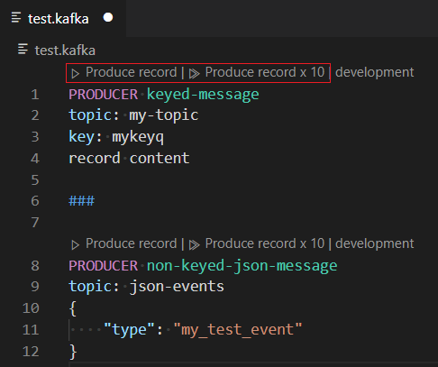

# Producing messages

Producing can be done by creating a [.kafka](KafkaFile.md#kafkafile) file. Write simple producers using the following format:

```
PRODUCER keyed-message
topic: my-topic
key: mykeyq
record content

###

PRODUCER non-keyed-json-message
topic: json-events
{
    "type": "my_test_event"
}
```

For actually producing a single record, click on the `Produce record` link above the `PRODUCER` line; for producing 10 records, click on `Produce record x 10`.



The log about produced messages is printed in the `Kafka Producer Log` Output view.

## Randomized content

Record content can be randomized by injecting mustache-like placeholders of [faker.js properties](https://github.com/Marak/faker.js#api-methods), like ``{{name.lastName}}`` or ``{{random.number}}``. Some randomized properties can be localized via the `kafka.producers.fakerjs.locale` setting.


### `kafka.producers.fakerjs.enabled`

Enable injection of [faker.js](https://github.com/marak/Faker.js/#api-methods)-randomized data in record templates, using the mustache syntax.

### `kafka.producers.fakerjs.locale`

[experimental] The locale used to generate [faker.js](https://github.com/marak/Faker.js/#api-methods)-randomized data in record templates.